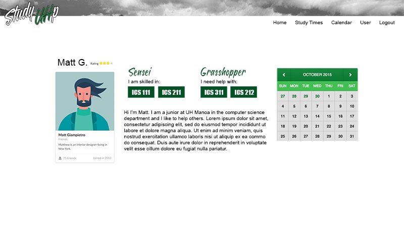

## Table of contents

* [Overview](#overview)
* [Goals of the Project](#goals-of-the-project)
* [Mockup Ideas](#mockup-ideas)

## Overview

Study UHp is a web application that can allows students to organize face-to-face groups for studying course material. It uses various technologies such as: 

* [Meteor](https://www.meteor.com/) for Javascript-based implementation of client and server code.
* [React](https://reactjs.org/) for component-based UI implementation and routing.
* [Semantic UI React](https://react.semantic-ui.com/) CSS Framework for UI design.
* [Uniforms](https://uniforms.tools/) for React and Semantic UI-based form design and display.

In order to minimize the possibility of cheating and taking advantage of the monetary incentives, grasshoppers will be required to submit proof of the help that they received (by providing screenshots or assignments). The submission will be sent to moderators to avoid cheating amongst classes. If the moderator decides that the submission was acceptable he/she will approve scoring and give the ‘sensei’ the number of rated points out of 5.

## Goals of the Project

* To encourage the use of ICSpace among ICS students
* To minimize risk of inappropriate encounters by requiring that all meetings occur in ICSpace.
* To encourage face-to-face interaction among ICS students.

### Goals of Team Members

* To put the skills we learn in class to the test.
* To gain experience working in a team to develop a web application.
* To exercise creative abilities
* To practice and improve skills using Meteor, React, Semantic UI, and MongoDB.

## Mockup Ideas

These are the ideas that we would like to implement in our web application.

### Landing Page

This is the first page that new or returning users see. Users can sign in or sign up.

### User profile page

### User sign up page
### User home page
### Admin home page
### User calendar page
### Create study session page
### Find study sessions page
### List study sessions page
### Leaderboard
### Friends

### Messages

