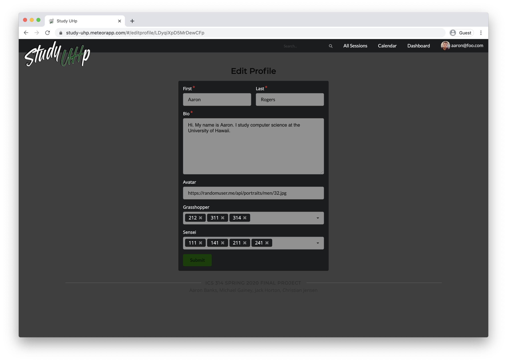
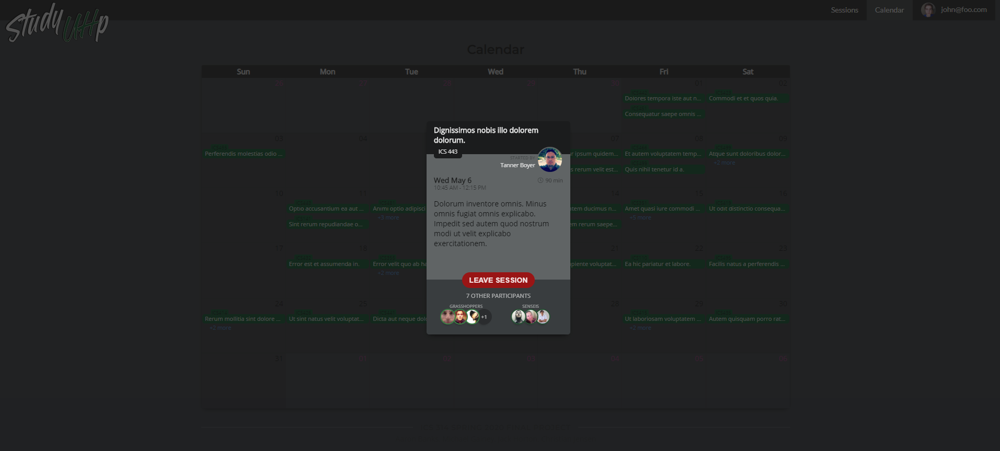

#### Table of contents

* [Overview](#overview)
* [Team Members](#team-members)
* [Goals of the Project](#goals-of-the-project)
* [Mockup Ideas](#mockup-ideas)
* [Milestone 1](#milestone-1)
* [Milestone 2](#milestone-2)
* [Milestone 3](#milestone-3)
* [Developer Guide](#developer-guide)

> ### [We have deployed Milestone 2 to Galaxy! Click here to check it out.](https://study-uhp.meteorapp.com/)

## Overview

Study UHp is a web application that allows students to organize face-to-face groups for studying course material. It uses various technologies such as: 

* [Meteor](https://www.meteor.com/) for Javascript-based implementation of client and server code.
* [React](https://reactjs.org/) for component-based UI implementation and routing.
* [Semantic UI React](https://react.semantic-ui.com/) CSS Framework for UI design.
* [Uniforms](https://uniforms.tools/) for React and Semantic UI-based form design and display.

In order to minimize the possibility of cheating and taking advantage of the monetary incentives, grasshoppers will be required to submit proof of the help that they received (by providing screenshots or assignments). The submission will be sent to moderators to avoid cheating amongst classes. If the moderator decides that the submission was acceptable he/she will approve scoring and give the ‘sensei’ the number of rated points out of 5.

## Team Members

- [Aaron Banks](https://abanks7.github.io/)
- [Jack Horton](https://johnhortoniv.github.io/)
- [Michael Gainey](https://micgainey.github.io/)
- [Christian Jensen](https://christianjensenv.github.io/)

### Goals of the Project

* To encourage the use of ICSpace among ICS students
* To minimize risk of inappropriate encounters by requiring that all meetings occur in ICSpace.
* To encourage face-to-face interaction among ICS students.

### Goals of Team Members

* To put the skills we learn in class to the test.
* To gain experience working in a team to develop a web application.
* To exercise creative abilities
* To practice and improve skills using Meteor, React, Semantic UI, and MongoDB.

## Mockup Ideas

These are our original mockup ideas which have been superseded by the Milestone 1 & 2 deployment.

### Friends

We would like to implement some kind of a "friends list" using the way Discord displays friends as a starting point.

### Other pages that currently do not have mockups:

#### Find study sessions page

Users can search for current and future study sessions by class.

#### Leaderboard

Still a WIP, but our "game mechanic" will have some type of ranking system to displays top users.

#### Messages

Either a private or public message system that will allow users to asks questions and post messages regarding study sessions.

## Additional functionality ideas if time permitting

- UH CAS login
- Text messaging
- Geolocation
- Slack integration
- Rating system

## Use Cases

Need to establish a set of use cases to use as development guidelines

## Milestone 1

Milestone 1 and past progress can be seen by clicking [here](/past).

Milestone 2
---

The goal of [Milestone 2](http://courses.ics.hawaii.edu/ics314s20/morea/final-project/experience-final-project-m2.html) is to improve the functionality, software engineering process, and quality of the application significantly. 

Milestone 2 is being managed with the [M2 Project Board](https://github.com/study-uhp/study-uhp/projects/3)

- [x] Admin functionality
- [x] Polish up all forms
- [x] Course collections
- [x] User collections

### Current Functionality:

#### Landing

The first page a user will see when coming to site.

#### User Sign Up

If a user does not currently have an account they can create one. We ask for some basic information about the user to get their profile started.

#### User Sign In

If the user already has an account they can proceed to sign in.

#### User Dashboard

The first page a user will see after logging in. They will also be directed here if logged in and return to the site or if they click on the logo in the navigation bar.

#### Study Sessions

The list of all currently scheduled study sessions. This is only available to logged in users. The "Join Session" functionality is not currently active, but will allow a user to join a study session if there is available space. The "view" link lets a user see more information about a currently scheduled session. A user can sort the list by any of the column headings, and also filter it to find any particular session by any category.

#### View Session

A user can view information about a scheduled session. In the future this will list all the participants and allow a user to join the session.

#### Create A Study Session

A logged in user can create a new study session. Currently only basic options are available, and in the future they will be able to specify more detail and also schedule a session for "Right Now!"

#### Edit A Study Session

A logged in user can edit a study session only if they are the "owner" of the study session. The same fields available upon creation and available to edit.

#### Calendar

Logged in users can view all of the upcoming study sessions in a calendar view. 

Currently clicking on a session will only provide a modal dialog with placeholder text. In the future a user will be given the option to view details about the session or join it.

#### User Profile

Currently just a placeholder mockup page. In the future logged in users will be able to see their profile which will include their class listing, bio, profile picture, and rating among other things.

A user can also edit their profile information, including adding and removing classes.

#### Admin

If a user is logged in with admin permissions they will be able to navigate to a special "Admin" page that will show a listing of all upcoming sessions. Currently the "Delete" button is not functional. In the future an admin user will have various control abilities over sessions and other aspects of the site.

Milestone 3
---
The goal of [Milestone 3](http://courses.ics.hawaii.edu/ics314s20/morea/final-project/experience-final-project-m3.html) is to significantly improve functionality from Milestone 2, and to find five UH community members to try out the system and provide feedback. 

### Session tab

In the session tab you can view all the sessions created. You can view up to 10 sessions per page. 

As you can see the session page on the right is grayed out on first load. This will later light up as you click to view other sessions.

This is the view after clicking on the session, and it will show all the current grasshoppers and senseis in the session. There is also a join session button that will add the user to the list of participants and update the session. After clicking 'JOIN SESSION', you will be prompted to choose whether you want to join as a grasshopper or a sensei.

Here you can choose which role you will be placed in on the session.

As you can see above, after joining the session you will be given the option to leave the session.

### Calendar

With the new calendar page, it will reflect the sessions made and update itself when a new session is made. In the calendar it will show all the sessions held on that day.

You can access any of the sessions on the calendar by clicking on one of the green tabs.

Here you can view, or join any session just like on the session page.

Developer Guide
---
This section provides information of interest to Meteor developers wishing to use this code base as a basis for their own development tasks.

### Installation
First, install [Meteor](https://www.meteor.com/install).

Second, visit the [Study-UHp application github page](https://github.com/study-uhp/study-uhp), and download the sources as a zip file or make a fork of the repo. However you do it, download a copy of the repo to your local computer.

Third, cd into the study-uhp/app directory and install libraries with:
~~~
$ meteor npm install
~~~
Fourth, run the system with:
~~~
$ meteor npm run start
~~~
If all goes well, the application will appear at [http://localhost:3000](http://localhost:3000).

### Application Design

Study UHp is based upon [meteor-application-template-react](https://ics-software-engineering.github.io/meteor-application-template-react/) and [meteor-example-form-react](https://ics-software-engineering.github.io/meteor-example-form-react/). Please use the videos and documentation at those sites to better acquaint yourself with the basic application design and form processing in Study UHp.

Initialization
---

The [config](https://github.com/bowfolios/bowfolios/tree/master/config) directory is intended to hold settings files. The repository contains one file: [config/settings.development.json](https://github.com/bowfolios/bowfolios/blob/master/config/settings.development.json).

This file contains default definitions for Users, Profiles, and Sessions and the relationships between them. Consult the walkthrough video for more details.

The settings.development.json file contains a field called “loadAssetsFile”. It is set to true, but if you change it to false, then the data in the file app/private/data.json will not be loaded. The code to do this illustrates how to initialize a system when the initial data exceeds the size limitations for the settings file.

Quality Assurance
---

### ESLint
Study UHp includes a [.eslintrc](https://github.com/bowfolios/bowfolios/blob/master/app/.eslintrc) file to define the coding style adhered to in this application. You can invoke ESLint from the command line as follows:

~~~
meteor npm run lint
~~~