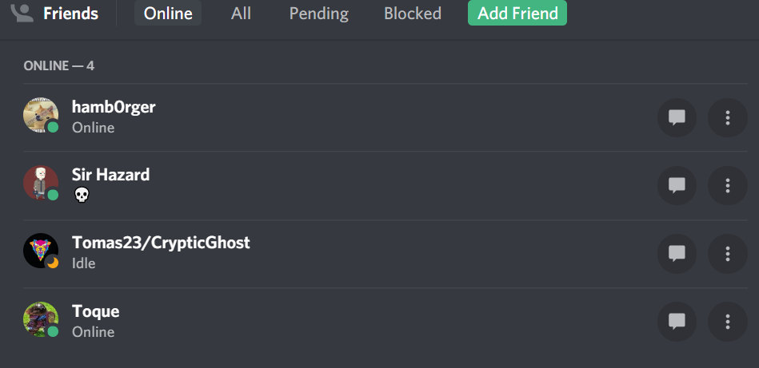
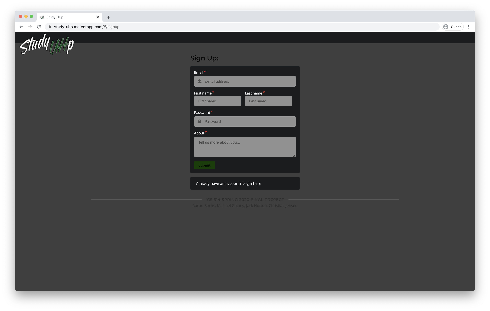
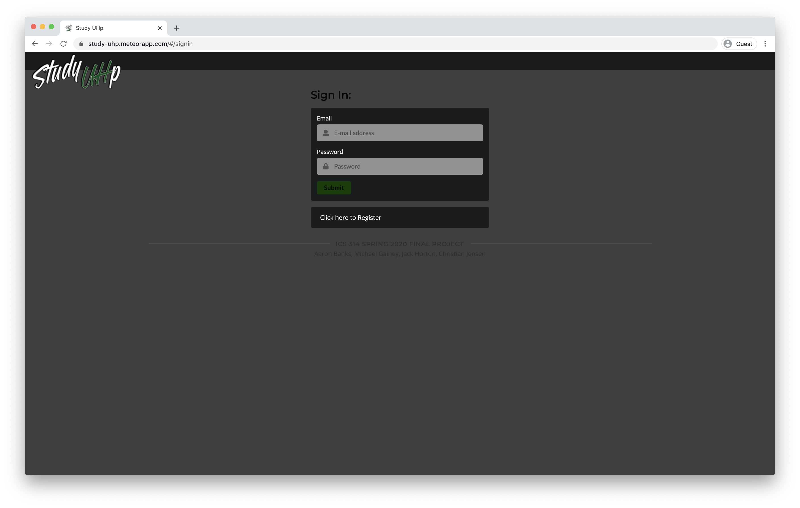
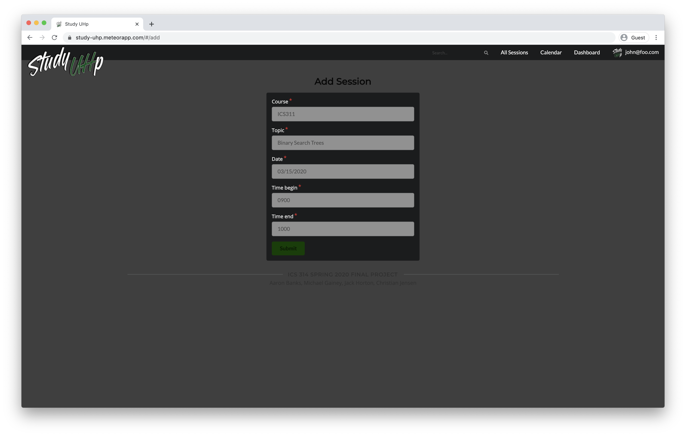
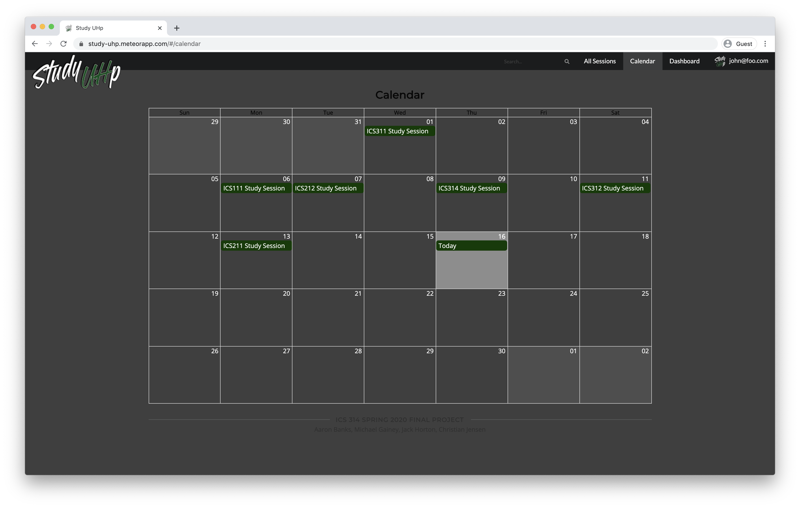
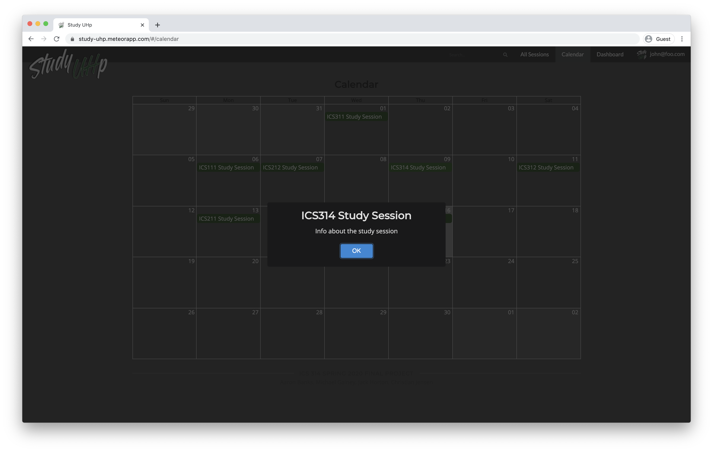

#### Table of contents

* [Mockup Ideas](#mockup-ideas)
* [Milestone 1](#milestone-1)

## Mockup Ideas

These are our original mockup ideas which have been superseded by the Milestone 1 deployment.

### Landing Page

This is the first page that new or returning users see. Users can sign in or sign up.

After signing in and clicking the top left icon, users will see this landing page.

### User profile page

The page a user will see when they view (and can edit) their own personal profile.

### Friends

We would like to implement some kind of a "friends list" using the way Discord displays friends as a starting point.

### Other pages that currently do not have mockups:

#### Find study sessions page

Users can search for current and future study sessions by class.

#### Leaderboard

Still a WIP, but our "game mechanic" will have some type of ranking system to displays top users.

#### Messages

Either a private or public message system that will allow users to asks questions and post messages regarding study sessions.

## Additional functionality ideas if time permitting

- UH CAS login
- Text messaging
- Geolocation
- Slack integration
- Rating system

## Milestone 1

- [x] Deployed to Galaxy
- [x] Landing page
- [x] Mockups of at least 4 other pages
- [x] GitHub issues/GitHub project board for management
- [x] IDMP practices
- [x] Home Page stuff:
  -  A link to the GitHub organization associated with this project and all of its repositories
  -  Up-to-date screen shots with a link to the same page running on Galaxy
  -  A link to the running deployment of your system on Galaxy
  -  A link to the M1 Project page - showing completed - no issues in the Backlog or In Progress for this milestone
  -  A link to the M2 Project page - showing the issues expected to be addressed

Milestone 1 was managed with the [M1 Project Board](https://github.com/study-uhp/study-uhp/projects/1)

### Functionality from Milestone 1:

#### Landing

The first page a user will see when coming to site.

#### User Sign Up

If a user does not currently have an account they can create one. We ask for some basic information about the user to get their profile started.

#### User Sign In

If the user already has an account they can proceed to sign in.

#### User Dashboard

The first page a user will see after logging in. They will also be directed here if logged in and return to the site or if they click on the logo in the navigation bar.

#### Study Sessions

The list of all currently scheduled study sessions. This is only available to logged in users. The "Join Session" functionality is not currently active, but will allow a user to join a study session if there is available space.

#### Create A Study Session

A logged in user can create a new study session. Currently only basic options are available, and in the future they will be able to specify more detail and also schedule a session for "Right Now!"

#### Edit A Study Session

A logged in user can edit a study session only if they are the "owner" of the study session. The same fields available upon creation and available to edit.

#### Calendar

Logged in users can view all of the upcoming study sessions in a calendar view. 

Currently clicking on a session will only provide a modal dialog with placeholder text. In the future a user will be given the option to view details about the session or join it.

#### User Profile

Currently just a placeholder mockup page. In the future logged in users will be able to see their profile which will include their class listing, bio, profile picture, and rating among other things.

#### Admin

If a user is logged in with admin permissions they will be able to navigate to a special "Admin" page that will show a listing of all upcoming sessions. Currently the "Delete" button is not functional. In the future an admin user will have various control abilities over sessions and other aspects of the site.

